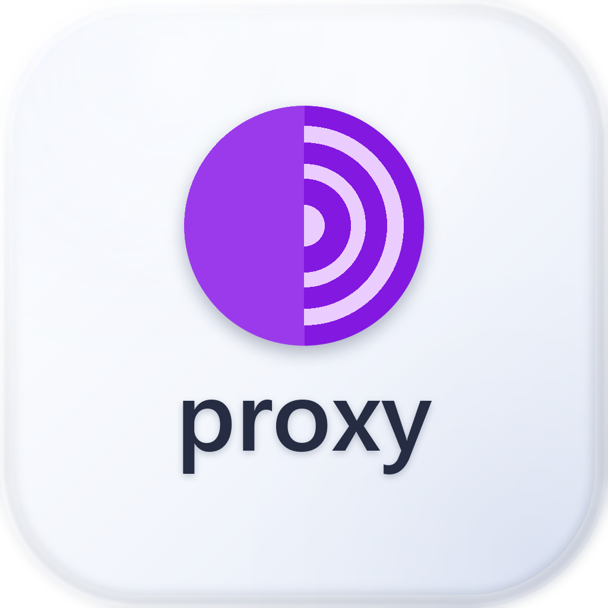

<p align="center">
  
</p>

# Local Proxy

Локальный HTTP/SOCKS5-форвардер с GUI: поднимает прокси на `127.0.0.1`, ходит через
внешний parent (HTTP CONNECT, **HTTPS/TLS** или SOCKS5 с логином и паролем) и умеет
отдавать трафик браузерам и приложениям — изолированными профилями или системным прокси.

Чистый Python 3 + tkinter, **без сторонних зависимостей** и без `proxy.exe`
(Defender на такие бинарники ругается). Тот же смысл, что у 3proxy, но на stdlib.

## Что умеет

- `listen` — локальный HTTP (+SOCKS5) на 127.0.0.1, порт настраивается
- `parent` — upstream **HTTP CONNECT**, **HTTPS (TLS до прокси, затем CONNECT)** или **SOCKS5** с авторизацией
- **режим apps** — прокси только внутри выбранных приложений (система не трогается)
- **режим system** — плюс системный прокси ОС (Windows: WinINET-реестр; macOS: `networksetup`)
- изолированные Chromium-профили (`--user-data-dir`) для Brave/Chrome/Edge/Firefox
- проверка «где я» (geo/exit-IP), тест прокси, журнал с ротацией
- кнопки **Connect** и отдельная **Disconnect** — разорвать соединение одним нажатием
- **Liquid Glass** интерфейс: светлая стеклянная тема, полупрозрачное окно, две вкладки —
  «Подключение» и «Приложения»

## Интерфейс

Две вкладки, чтобы поля и списки не сваливались в одну колонку:

| Вкладка | Что внутри |
|---|---|
| **Подключение** | профиль, строка для вставки, host / порт / протокол, логин и пароль, системный прокси, диагностика, локальные адреса |
| **Приложения** | список приложений для запуска через прокси, выбор браузера и его изолированного профиля, журнал |

Кнопки **Connect / Disconnect** вынесены под вкладки и видны всегда.

## Протоколы parent

| Протокол | Что делает | Когда нужен |
|---|---|---|
| `HTTP` | обычный `CONNECT host:port` к parent | большинство продавцов |
| `HTTPS` | TLS-рукопожатие с parent, затем `CONNECT` внутри туннеля | если продавец отдаёт порт с TLS |
| `SOCKS5` | SOCKS5 с логином/паролем | SOCKS5-прокси |

Автовыбор: при нажатии **Connect** приложение параллельно пробует выбранный протокол
и альтернативные, и поднимается на том, который ответил. Выбор сохраняется в профиле.

## Установка

### Windows

```
install\Install Local Proxy.bat        # двойной клик или из консоли
```

или из PowerShell:

```powershell
.\install\install-windows.ps1                 # в %LOCALAPPDATA%\Programs\LocalProxy
.\install\install-windows.ps1 -InPlace        # запуск прямо из этой папки
.\install\install-windows.ps1 -DryRun         # показать план, ничего не менять
.\install\install-windows.ps1 -MigrateProfiles  # перенести browser_profiles из старой установки
```

Что делает: находит Python 3 с tkinter, копирует приложение, переносит `proxy_config.json`
из старой установки (если есть), создаёт ярлыки на рабочем столе / в меню Пуск,
регистрирует удаление в «Установка и удаление программ».

Удаление: `install\Uninstall Local Proxy.bat` (или `uninstall-windows.ps1 -Purge`).

### macOS

```bash
bash install/install-macos.sh              # в ~/Applications/Local Proxy
bash install/install-macos.sh --system     # в /Applications (спросит sudo)
bash install/install-macos.sh --dry-run    # показать план
```

или двойным кликом по `install/Install Local Proxy.command`.

Что делает: проверяет `python3` с tkinter, ставит приложение, собирает
**Local Proxy.app** (иконка `.icns` через `sips`+`iconutil`, если доступны),
создаёт команду `localproxy` в `~/.local/bin`.

Нужен Python 3 с tkinter — на macOS это `brew install python-tk@3.12` либо
Python с python.org (там tkinter внутри).

Удаление: `bash install/uninstall-macos.sh` (или `--purge`, чтобы снести и конфиг).

## Запуск без установки

```bash
python3 start.pyw        # macOS / Linux
py -3 start.pyw          # Windows
```

## Файлы

```
start.pyw            точка входа (GUI без консольного окна)
proxy_tool.py        вся логика: listener, parent-аплинк, GUI, профили браузеров
assets/              Liquid Glass иконки (png + ico)
install/             инсталляторы и деинсталляторы: Windows + macOS
proxy_config.json    сохранённые подключения (создаётся при первом запуске, в git не идёт)
browser_profiles/    изолированные профили браузеров (в git не идут)
proxy.log            журнал с ротацией (в git не идёт)
```

## Платформы

| | Windows | macOS |
|---|---|---|
| GUI, listener, parent-аплинк | ✅ | ✅ |
| Системный прокси | WinINET (`winreg`) | `networksetup` (все активные сервисы) |
| Поиск браузеров | реестр App Paths + Program Files | `/Applications/*.app/Contents/MacOS/*` |
| Поиск процессов профиля | `wmic` | `ps -axo` |
| Тема заголовка окна | DWM (`dwmapi`) | — |
| Инсталлятор | `install-windows.ps1` + `.bat` | `install-macos.sh` + `.command` |

Windows-путь проверен на этой машине; macOS-ветки написаны и синтаксически проверены,
но **на реальном Mac не запускались** — если что-то не так, правки точечные
(поиск браузера, `networksetup`, `ps`).

## Логотип

В иконке используется знак **Tor Browser** (фиолетовый лук со слоями) и слово `proxy`.
Это товарный знак **Tor Project** — проект не связан с Tor Project и не одобрен им.
Если планируешь распространять приложение, лучше заменить знак на свой.

## Безопасность

- `.env`-подобных файлов нет; реальные прокси-подключения лежат в `proxy_config.json` —
  он в `.gitignore` и на GitHub не уходит
- TLS до parent идёт без проверки сертификата: у продавцов часто self-signed,
  а успешный `CONNECT` уже доказывает, что прокси живой; полезная нагрузка внутри
  туннеля сохраняет собственный end-to-end TLS
